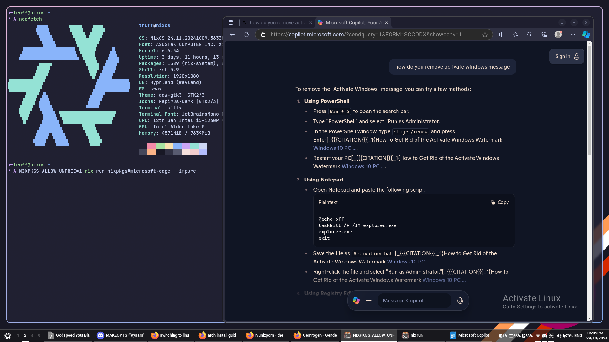
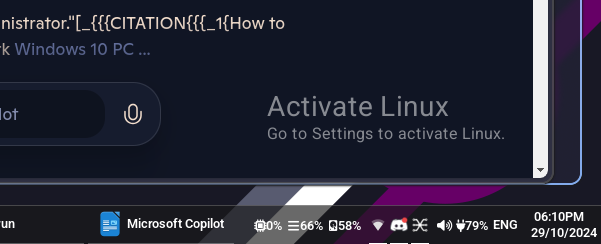

# Activate-Linux

A stupid little joke program for Wayland




## Running

Ensure libxkbcommon and pkg-config are installed, then simply `cargo run`.

The repo can also be ran as a flake:
```
nix run github:Perigord-Kleisli/activate-linux
```
