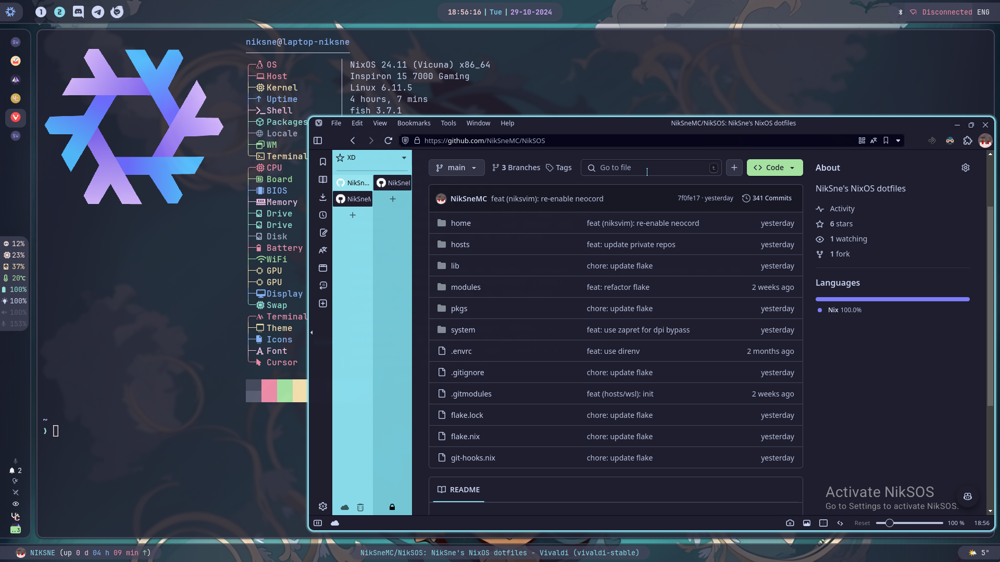

# Activate-NikSOS

A stupid little joke program for Wayland




## Running

Ensure libxkbcommon and pkg-config are installed, then simply `cargo run`.

The repo can also be ran as a flake:
```
nix run github:NikSneMC/activate-niksos
```

## Credits:
- Original program: [Perigord-Kleisli/activate-linux](https://github.com/Perigord-Kleisli/activate-linux)
